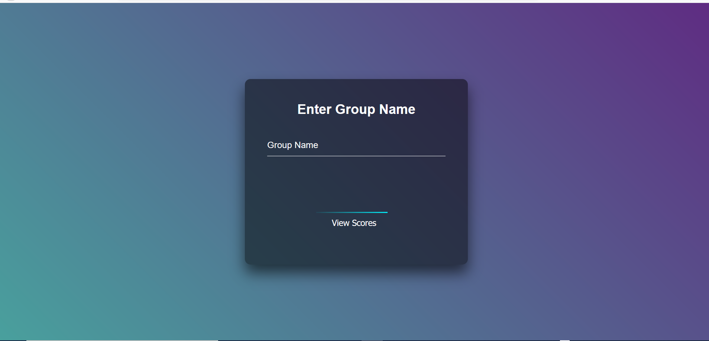
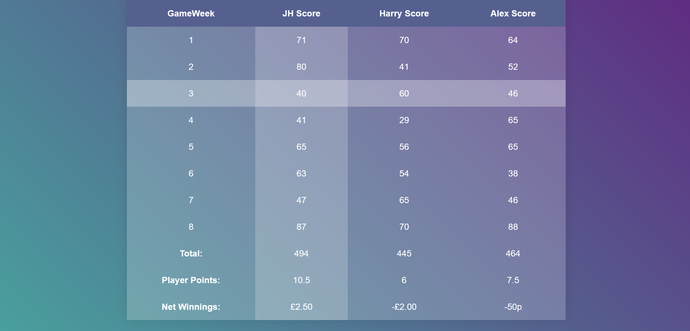

# FPL Scores Calculator 

A project built in Flask that communicates with the Fantasy Premier League Public API, and returns scores formatted in a clear and modern interface. 

Next steps: 
- Users creating their own groups 
- Postgres database implementation




<br>

#### To run this project: 
```
pip3 install -r requirements.txt
export FLASK_APP=app/app.py
flask run
````
Then navigate to localhost:5000. 
Deployment to AWS coming imminently!

#### To run tests:
```
pytest
```